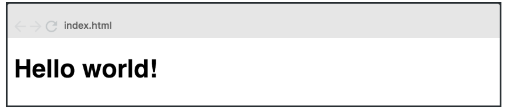
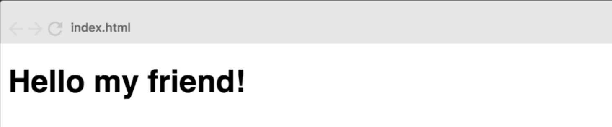
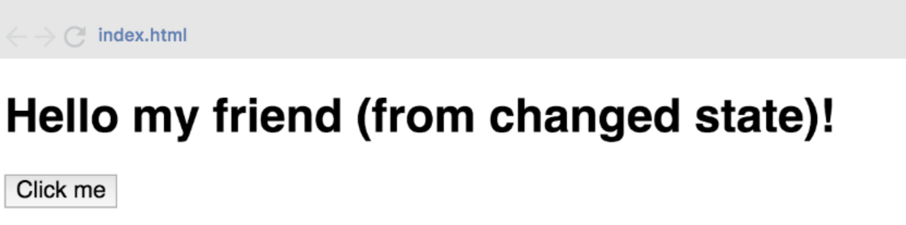

# React + Vite

This template provides a minimal setup to get React working in Vite with HMR and some ESLint rules.

Currently, two official plugins are available:

- [@vitejs/plugin-react](https://github.com/vitejs/vite-plugin-react/blob/main/packages/plugin-react/README.md) uses [Babel](https://babeljs.io/) for Fast Refresh
- [@vitejs/plugin-react-swc](https://github.com/vitejs/vite-plugin-react-swc) uses [SWC](https://swc.rs/) for Fast Refresh

Trabajo practico React
1- Hello world - Dificultad:  🟢
Crear una aplicación web con un componente que muestre en pantalla el mensaje “Hello World”.

2- Hello world (parte 2)- Dificultad:  🟢

Modificar el componente anterior y enviar mediante props el valor “My friend” de manera que el mensaje quede de la siguiente forma: 

3 -Hello world (parte 3) - Dificultad:  🟢

Modificar el programa anterior agregando al componente un state con la clave msj: “(from changed state)”, además agregar un botón al presionar este botón (onClick), el state de la clave msj se debe mostrar por pantalla de la siguiente manera: 

